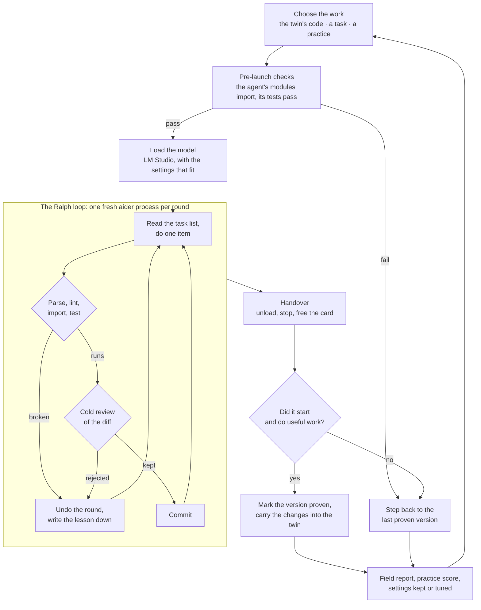

# OrthrosCode

**Two local AI coding agents that build what you ask, and take turns making each other better.**
No cloud, no API keys, no accounts -- one GPU, one open model, and a referee.

Orthros, the two-headed dog of Greek myth, is one body with two heads that never
sleep at the same time. OrthrosCode has two heads too: agents **A** and **B**,
running one at a time on the same card. Give them a project and they take turns
building it. Leave them to themselves and they take turns rewriting each other's
source code: A improves B, then B wakes up running A's changes and improves A.
Changes that make an agent a better coder are copied into both; changes that
break one are rolled back.

Everything runs on your machine, and every step is a git commit you can read.


## At a glance

- **Two modes.** *Work on a task* builds a project you describe. *Improve each
  other* is recursive self-improvement, measured by how well the agents code on
  jobs they have never seen.
- **Improvements are proven by use.** A change counts only once the agent that
  received it has started and done real work with it. Only then is it copied
  into the agent that wrote it.
- **It survives its own mistakes.** Pre-launch checks, rollback, a history of
  proven versions and a baseline that is never lost keep a bad change -- even one
  that looked good and was copied into both -- from ending the run.
- **It fits the machine.** Context size and timeouts are tuned from what each
  turn measures, so a bigger card is used in full and a smaller one is not
  overrun.
- **It runs unattended, and says when it cannot.** Failures are retried,
  worked around or parked; when a person is needed, it stops loudly.

## Two modes

The switch at the top of the dashboard picks what the agents work on. A switch
takes effect at the next handover; a turn in progress finishes as it began.

### Work on a task

Press **New task**, give it a name and describe what to build: what goes in,
what comes out, how you would check it works. Orthros creates
`tasks\<name>\`, a project with its own git history, and A and B take turns on
it with the same turn lengths, handovers and safety nets as self-improvement.
The first round turns your description into a task list of small, checkable
items; later rounds work through it, and plan more when it runs dry. Steer it
with **Suggest direction** for *the task*.

A good turn on a task also proves the agent that ran it, and the task's
results, including its own tests, go into that agent's field report.

### Improve itself

A works on B's code, then B on A's. Each keeps a task list, a plan and a
mission for its twin, in the twin's folder. To keep the two from colliding they
split the work: A builds **memory, knowledge and skills** into B; B builds
**tools, efficiency and research** into A. Proven work flows both ways.

"Better" means writing working code on projects never seen before, not only
getting better at editing itself. So every few turns (`practice_every`), one
turn is a **practice**: a fresh copy of a small exercise from `exercises\`, a
short session, then tests the agent never saw are run against what it wrote.
The score goes into the agent's field report, which its twin reads when
deciding what to improve, and the standing mission says that these scores are
the measure that matters.

## How a turn works



1. **Choose.** The mode decides the folder: the twin's code, the task, or a
   practice exercise.
2. **Pre-launch checks.** Orthros imports every module of the agent and runs
   its test suite -- seconds, where a failed launch costs minutes of model
   loading. A broken agent is rolled back before anything is loaded.
3. **Work.** The agent loads the model and works through the task list, one
   item per round. Each round's change is parsed, linted, imported, run and
   tested; checked across the whole project for broken calls, placeholders and
   lost tests; then read by an independent reviewer, and once more by a reader
   hunting for the bug. Kept
   rounds are committed; anything else is undone, and the reason is written
   down for the next try.
4. **Handover.** The model is unloaded, the server stopped, anything left
   running is killed. Only then does the other agent start.
5. **Judgement.** An agent that started and did useful work has proven its
   version, and the changes its twin made to it are carried into the twin as
   well. One that did not start steps back to its last proven version, and so
   do changes that cost it two weak turns in a row. A weak turn on a proven
   version counts against nothing: there is nothing new to blame.
6. **Report.** Rounds, kept and rejected changes, errors, speed and scores go
   into the field report its twin reads when planning.

## Built on

OrthrosCode is a referee and a workflow around two existing programs.

**[LM Studio](https://lmstudio.ai)** downloads open-weight models and runs them
on your GPU, serving them on `127.0.0.1` with the same protocol as the OpenAI
API. OrthrosCode drives it through its command-line tool, `lms`: it loads the
model with the chosen context, checks it really answers, reloads it when the
engine fails, and unloads it at handover so the other agent starts on a free
card. No request leaves the machine.

**[aider](https://aider.chat)** ([source](https://github.com/Aider-AI/aider)) is
an open-source AI pair programmer. It sends files and a message to a model,
applies the edits that come back, runs the linter and tests, and feeds failures
back to the model within the same exchange. OrthrosCode runs one aider process
per round, pointed at LM Studio, chooses which files it may edit, and reads its
output to tell what happened. Unattended, aider may edit files but never runs a
command the model suggests.

**The Ralph loop** ([Geoffrey Huntley](https://github.com/ghuntley/how-to-ralph-wiggum))
is the technique around aider: instead of one long conversation, run the same
prompt again in a fresh process and keep progress in files and git. Each round
starts with an empty head and re-reads the task list from disk, so no round has
to hold the whole project -- which is what lets a small context window work on a
codebase far bigger than it.


On top of the loop, techniques that trade time for reach on a small window:

| Technique | Source | Here |
|---|---|---|
| Search before you build | Huntley, *how-to-ralph-wiggum* | rounds check with `FIND:` before adding what may already exist |
| Acceptance criteria on every item | [fstandhartinger/ralph-wiggum](https://github.com/fstandhartinger/ralph-wiggum) | items end with `Done when:`, and the reviewer holds the change to it |
| Count the tries | fstandhartinger/ralph-wiggum (`NR_OF_TRIES`) | an item that ends turn after turn without progress is parked for a person |
| Repeated sampling with a verifier | Brown et al., *Large Language Monkeys* (2024) | several tries per item, each warmer than the last; tests and the reviewer keep the one that holds |
| Localize before repairing | Xia et al., *Agentless* (2024) | an item that names no file first asks which files, from an outline of every module |
| Gist memory | Lee et al., *ReadAgent*, Google DeepMind (2024) | `GISTS.md` sums up every module in a few lines for planning rounds |
| Chain of agents | Zhang et al., *Chain of Agents*, Google (2024) | `DIGEST:` reads a file of any length in parts, carrying notes forward |

*Recursive Language Models* (Zhang, Kraska and Khattab, 2025) are left out on
purpose: they have the model write and run code over its input, and the
unattended loop never runs model-written code.

## What you need

- **Windows 10 or 11.** The launchers and process handling are Windows-only.
- **An NVIDIA GPU.** A 24 GB card runs the default model -- a 27B model at 4-bit
  -- with 64k of context. Smaller cards work with a smaller model; larger ones
  are used in full (see [Self-configuration](#self-configuration)).
- **About 25 GB of disk**: roughly 17 GB for the model, 1 GB for packages.
- **32 GB of RAM and a page file Windows can grow.** The driver charges system
  memory to back what the model puts on the card, so this matters as much as
  video memory -- see [Memory](#memory).
- **Python 3.10, 3.11 or 3.12** for aider (newer ones may sit beside it),
  **Git** and **LM Studio**. All free.

## Setup

1. **Install Python 3.12** from https://www.python.org/downloads/ and tick
   *"Add python.exe to PATH"*.
2. **Install Git** from https://git-scm.com/download/win (the defaults are fine).
3. **Install LM Studio** from https://lmstudio.ai and open it once.
4. **Download a model** in LM Studio's search tab. The default is **Qwen 3.8
   27B** (`qwen/qwen3.8-27b`, Q4_K_M). Any capable coding model works.
5. **Double the context for free.** In LM Studio open the model's default
   settings (*My Models*, the gear icon), turn **Flash Attention** on and set
   **K** and **V cache quantization** to **Q8_0**. The cache then takes half the
   memory, with no noticeable loss.
6. **Get OrthrosCode**: clone this repository, or download it as a ZIP and
   unpack it anywhere.
7. **Run `SETUP.bat`.** It installs aider and its dependencies once into
   `shared-venv\` (with a Python aider supports), then creates the two agents,
   `OrthrosCode A\` and `OrthrosCode B\`, each with its own git history and a
   thin venv of its own. It reports whether it found LM Studio's `lms` tool; if
   not, install it from LM Studio's developer settings, or set `LC_LMS_PATH` in
   each agent's `config.cmd`.
8. **Using a different model?** `LIST_MODELS.bat` in either agent folder lists
   the keys; set `LC_MODEL_KEY` in both agents' `config.cmd`.
9. **Check the chain** with `SELFTEST.bat` in `OrthrosCode A\`: it starts the
   server, loads the model, sends one message and unloads it. Close other
   GPU-heavy programs first, including any second LM Studio or ollama.
10. **Run `ORTHROS.bat`.** The dashboard opens in a window of its own. Choose a
    mode and press **Start**, and allow notifications when asked.

**No GPU?** `ORTHROS.bat --simulate` runs the same dashboard and orchestration
on two stand-in agents in a temporary folder, with turns of a few seconds.

## The dashboard

- **Mode**: *Improve itself* (with how often to practise, and recent
  practice scores) or *Work on a task* (pick one, or create one).
- **Agents**: who is working, on what, which round and try; rounds, changes
  kept and sent back, tokens; each agent's version and whether it is proven.
- **GPU**: a slowly turning lattice whose lit share is the card's utilization
  from `nvidia-smi` -- the share of time its CUDA cores had work -- with a plane
  for memory in use, the numbers beneath, and the settings in use. **Check
  hardware** looks at the machine again.
- **Raw output**: a read-only terminal of the running turn's log as it is
  written: the agent, aider and the model's replies.
- **Talk to Orthros**: **Ask** how it is going, what went wrong, what is next or
  what temperatures are used, and get a few plain sentences from Orthros's own
  records. **Suggest direction** puts your words at the top of an agent's list
  or the task's, straight away or as soon as the running turn stops using it.
- **Balance** of time and tokens between the two, and **recent events**.

**Pause after this session** lets the turn finish, then stops. **Stop after
this round** stops at the next safe point, once the round in flight is checked
and committed. **Force stop** kills the turn at once.

When Orthros gives up -- a machine that will not recover, idle turns, low
memory or disk -- it writes `ORTHROS-NEEDS-YOU.txt` saying why, turns the page
red, raises a desktop notification and beeps. Pressing **Start** clears it.

## Self-configuration

The agents' `config.cmd` is the starting point; Orthros fits it to the machine
and remembers what works, in `hardware.json`.

- **Looking at the hardware** -- the card, its memory, system memory, and what
  the model supports -- happens only when there is reason to: the first start,
  after `SETUP.bat` has run, when the card itself changes, or when asked
  (**Check hardware**, or `orthros.py --probe`).
- **Between looks**, each turn's own log shows how much of the card was left
  free once the model loaded, and how fast it answered. From that, one step at
  a time: more context when a lot of the card sits idle, less when it runs
  short, longer timeouts for a slower machine.
- **Every change is a trial.** It runs for one turn and becomes the last good
  setting only if that turn runs clean. A change that fails to load or runs
  out of memory puts the last good settings back and is not tried again.

Set `auto_tune` to `false` in `orthros.json` to run on `config.cmd` alone.

## Settings

`orthros.json`, written on first run, holds Orthros's settings:

| setting | default | |
|---|---|---|
| `session_minutes` | 60 | a turn's length, before balancing nudges it (45--60 suits a 24 GB card) |
| `first` | A | who goes first on a fresh start |
| `launch_minutes` | 20 | time to reach the first round before it counts as a failed start |
| `grace_minutes` | 30 | time past its end before a turn is asked to stop |
| `pause_after_idle` | 4 | turns in a row with nothing kept before Orthros stops (0 = never) |
| `practice_every` | 4 | in self-improvement, one turn in this many is a practice (0 = never) |
| `practice_minutes` | 20 | length of a practice turn |
| `park_after_tries` | 2 | turns in a row ending on one item without progress before it is parked |
| `env_retry_minutes` | [2, 5, 15] | waits before retrying a start the machine made fail |
| `auto_tune` | true | fit context and timeouts to the machine (see above) |
| `aider_guard` | true | keep aider's prompts inside the context window (see Safety nets) |
| `min_free_mb`, `critical_free_mb` | 4096, 1536 | memory to start a turn, and to end one early rather than be killed |
| `min_free_disk_mb` | 2048 | disk needed to start a turn |
| `keep_logs` | 300 | turn logs kept in `logs\` |
| `gpu_telemetry` | true | poll `nvidia-smi` for the dashboard |
| `install_requirements` | false | install an agent's changed `requirements.txt` into its own venv (off: it would download whatever the twin wrote there) |

Each agent's `config.cmd` holds its own settings, each with the reason beside
it: the model, context, temperatures, tries per item, and the rest.
Temperature follows the kind of round: cold (`LC_TEMP_CODE`, 0.2) for writing
code and checking finished work, warm (`LC_TEMP_BRAINSTORM`, 0.85) for planning
new work, halfway for breaking a milestone into items; the reviewer runs at 0.1.

## Steering and following along

**Steering.** In self-improvement each agent's notes about its twin live in the
twin's folder: `OrthrosCode B\orthros_tasks.md` is the list **A** works through
while improving **B**, beside `PLAN.md` (milestones, broken into items as the
list empties) and `RALPH_PROMPT.md` (the mission, sent with every round). A
task keeps the same files in its own folder. Edit any of them, or use
**Suggest direction**. `SETUP.bat --mission` rewrites the agents' missions from
the templates in `orthros_setup.py`.

**Following along.**

- `git log` in any agent or task folder. Tags mark `orthros/baseline`,
  `orthros/proven-N`, `orthros/failed-N` and `orthros/withdrawn-...`.
- `FIELD_REPORT.md` in each agent folder: how that agent did, turn by turn,
  with practice scores and task results. `LESSONS.md`: mistakes caught, fed
  back into every round. `PROGRESS.md`: one row per session.
- `ROLLBACK.md` after a rollback: the undone diff, for the rounds that must
  redo the useful part.
- `orthros.log` for what Orthros did; `logs\` for each turn's full output.

**Changing the agents' code yourself.** `agent\` is the template the agents
are made from; the agents themselves are separate git histories. To bring a
change made in `agent\` into both, close Orthros and run
`python orthros.py --apply-patch <file>`, where the file is a
`git diff --relative=agent -- agent/`. Each agent takes it file by file with a
three-way merge; what applies is checked and recorded as its newest proven
version, and anything that clashes with the agents' own changes is listed and
left out. `patches\` holds the patches that come with this repository.

**Publishing.** `ORTHROS.bat --export` copies the newest proven agent into
`agent\` and writes `EVOLUTION.md`; commit those, and this repository's history
becomes the record of how the agents evolved.

## The agents' tools

| | |
|---|---|
| **Linter** | flake8's error rules, inside each round, so the model fixes its own slips at once |
| **Tests** | a unittest suite, after every edit, every round and before launch |
| **Automatic checks** | after every round, at no token cost: lint and call signatures across the whole project (only what the round added counts), placeholders where code was cut, conflict markers, deleted tests. A round they catch is undone. A test class added below `if __name__ == "__main__":` is put right instead |
| **Test first** | an item whose `Done when:` names something a test can run gets a round that writes only that test, and the loop checks it fails; the code rounds then have to make it pass. The test is kept only together with the code that passes it |
| **Reviewer** | a separate, cold request that reads each diff against its item, told what the automatic checks noticed and have already settled, and shown the code the item names as it stands after the round -- so a name imported above the diff, or a part an earlier round already did, is not held against the change. A rejection cites each fault with the line it objects to; a fault whose line is not there, or that calls a name undefined when the project defines it and pyflakes agrees, is dropped, and a rejection left with no fault standing keeps the change |
| **Second look** | when the reviewer keeps a change, another read assumes there is a bug and hunts for it; a bug it names is confirmed by a third read before the change is undone. Both see what the reviewer saw |
| `FIND: text` | every line in the project containing it, in `FOUND.md` next round |
| `CALLERS:`, `DEF:`, `OUTLINE:` | every call to a function, where a name is defined, a file's classes and defs -- in `FOUND.md`. Every request the loop answers is added to each round's prompt |
| `DOCS: module` | an installed library's own documentation, offline |
| `RESEARCH: question` | a web search and page fetch, in `RESEARCH.md` |
| `DIGEST: file -- question` | a file too big for a round, read in parts, answer in `FOUND.md` |
| `TESTS: test_file` | one of the project's test files run on its own, its output in `FOUND.md` |
| **Locate** | an item naming no file asks which files first, from an outline of every module |
| **Gists** | `GISTS.md`: every module in a few lines, for planning rounds |
| **Warming retries** | each try at an item runs warmer, so the tries differ |
| **Lessons** | every rollback, rejection and parked item becomes a line in `LESSONS.md` |
| **Skills** | `SKILLS.md`: how common changes are made in this codebase |
| **Planning** | milestones in `PLAN.md`, broken into items as the list empties, with checks of finished work |
| **Stop-path check** | a test that reads the loop's own source and fails any way of ending a session without saying why |

## Safety nets

| | |
|---|---|
| **Local only** | Every model call goes to LM Studio on your machine. No keys, no telemetry; aider's update check and remote model lists are off. |
| **No shell** | Unattended aider edits files but never runs a command the model suggests. |
| **Tests as a gate** | After every edit, every round and before every launch. A change that fails them is rolled back. |
| **Many readers** | Every change is parsed, linted, imported, run, tested, checked for broken calls, placeholders and lost tests, reviewed, and read again by a reader looking for the bug. Any one of them can undo it. |
| **Rollback** | Folders are committed before each turn. An agent that fails to start is reset, and its failed version kept as a git tag. |
| **Proven history** | Every proven version is remembered. A change that turns out fatal after being copied into both is stepped back past, as far as the baseline if need be. |
| **Prompts that fit** | A guard loaded into the agents' Pythons keeps aider from pulling files into a round past what the window holds, or sending a prompt the window cannot take. A refused prompt is never mistaken for a crashed engine. |
| **Recover, then stop out loud** | Machine failures are retried after 2, 5 and 15 minutes; an item that ends two turns in a row is parked; changes sent back and items parked count as a turn working, not as a stall; an early stop becomes the twin's first item. When nothing more can be done, Orthros stops and says so. |
| **Settings on trial** | A tuned setting is kept only after a clean turn; one that fails is withdrawn for good. |
| **Fair turns** | Turns alternate, and their length leans towards an even split of time and tokens. |

## Memory

Windows has one limit covering everything every program may need -- the
*commit limit*, physical memory plus the page file. The graphics driver charges
system memory against it to back what a model puts on the card, so a model
using 18 GB of video memory needs roughly as much again in commit. At the limit
Windows refuses allocations and kills processes: the engine reports "bad
allocation", agents die mid-round, and Orthros itself can be killed, which
looks like a frozen page. Free video memory is not the number to watch.

1. **Give Windows a bigger page file**: System > About > Advanced system
   settings > Performance > Settings > Advanced > Virtual memory; system-managed,
   or a fixed 32 GB, on an SSD.
2. **Close browsers and Electron apps during a run.**
3. **Use a smaller model or context** if it still happens.

Orthros will not start a turn with less than `min_free_mb` of the commit limit
free, and asks a turn to stop after its round if free memory falls below
`critical_free_mb`. Each field report records the least memory free.

## Troubleshooting

- **"Not starting an unattended run while the card is shared."** Close any other
  LM Studio window, ollama or GPU-heavy game, then start again.
- **"bad allocation", or the engine keeps dying.** Almost always the commit
  limit -- see [Memory](#memory). If the log shows gigabytes of video memory
  free, it is system memory, and a bigger page file is the answer.
- **"aider is not installed in the venv."** The agents' venvs must use the same
  Python as `shared-venv`. Run `SETUP.bat` again; it rebuilds any that do not.
- **The page stopped updating and nothing handed over.** Orthros was killed,
  usually by the memory limit. The agent finishes on its own; start
  `ORTHROS.bat` again and it takes that turn into account.
- **Orthros stopped with a message, or `ORTHROS-NEEDS-YOU.txt` appeared.** It
  says why. The turn's full output is in `logs\`; the agent's session log is
  `.localcoder-ralph.log` in the folder it was working in. Press **Start** once
  it is dealt with.
- **Linux or macOS?** `--simulate` and the test suites run anywhere; real runs
  need Windows. Porting the launchers would make a good contribution.

## Layout

```
ORTHROS.bat, orthros.py, orthros.html   the referee and its dashboard (standard library only)
orthros_work.py                         what a turn works on: the twin, a task or a practice
orthros_tune.py                         fitting the settings to the machine
orthros_guard\                          loaded into the agents' Pythons: keeps prompts in the window
exercises\                              practice jobs, each with hidden tests
agent\                                  the agent's code: the template both agents start from
SETUP.bat, orthros_setup.py             builds the rest; holds the mission templates
tests\                                  the referee's tests: python -m unittest discover -s tests
patches\, docs\                         patches for existing agents; notes
LICENSE, README.md

made on your machine, not in the repository:
shared-venv\                            aider and its dependencies, installed once
OrthrosCode A\, OrthrosCode B\          the two agents, each its own git repository
tasks\, practice\                       task projects and practice copies
logs\, orthros.log, orthros.json        what happened, and the settings
hardware.json                           what Orthros found out about this machine
```

The agent's own files and settings are described in [agent/README.md](agent/README.md).

## Credits

Built on [aider](https://aider.chat) and [LM Studio](https://lmstudio.ai), and
driven by the Ralph loop of [Geoffrey Huntley](https://github.com/ghuntley/how-to-ralph-wiggum):
the same prompt in a fresh process, state on disk, one item per loop, search
before building, backpressure from tests. Acceptance criteria on every item and
counting attempts per item come from
[fstandhartinger/ralph-wiggum](https://github.com/fstandhartinger/ralph-wiggum).
The research behind the long-context techniques is credited in
[Built on](#built-on). Released under the [MIT license](LICENSE).
