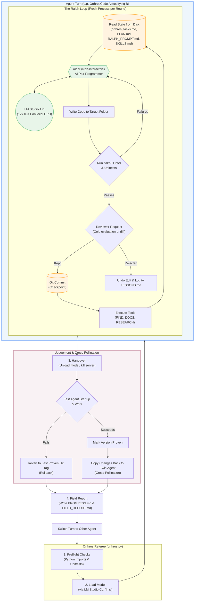

# OrthrosCode

**Two local AI coding agents that take turns improving each other.**
No cloud, no API keys, no accounts -- one GPU, one open model, and a referee.

Orthros, the two-headed dog of Greek myth, is one body with two heads that
never sleep at the same time. OrthrosCode has two heads too: agent **A**
rewrites agent **B**'s source code to make it a better coder, then **B** wakes
up running A's changes -- and improves **A**. Changes that make an agent better
are copied into both. Changes that break one are rolled back. The loop runs for
as long as you let it.

It is an experiment in *recursive self-improvement* you can run 100% locally,
where every step is a git commit you can read.

---


## Why it is interesting

- **Improvements are proven by use.** A change only counts once the agent that
  received it has started up and done real work with it. Only then is it
  copied into the agent that wrote it.
- **The agents work on themselves.** Their standing mission is to give each
  other better *tools*, *memory*, *skills*, *research*, *knowledge* and
  *efficiency*. Every change an agent makes is a change it will be running
  soon.
- **It is built to survive its own mistakes.** Pre-launch checks, rollback, a
  history of proven versions, and a baseline that is never lost mean that a bad
  change -- even one that looked good and was copied into both -- is less likely to
  take the experiment down.
- **Everything is local and inspectable.** Inference runs in LM Studio on your
  own card. Each agent's evolution is an ordinary git history, with a field
  report after every turn.

## What it is built on

OrthrosCode is a referee and a workflow around two existing programs. Neither
is written by this project, and both are worth knowing before you start.

### LM Studio -- the model, on your machine

[LM Studio](https://lmstudio.ai) is a free desktop app that downloads
open-weight language models and runs them on your own GPU. It serves them over
a local HTTP interface on `127.0.0.1` that speaks the same protocol as the
OpenAI API, so ordinary tools can talk to it without knowing the difference.
It also ships a command-line tool, `lms`.

OrthrosCode uses `lms` to do the housekeeping a long unattended run needs:
load the model with a chosen context size, ask it a question to confirm it is
really answering (a wedged engine still looks "loaded"), reload it when its
engine crashes, and unload it at handover so the other agent starts on a free
card. Nothing is sent anywhere: there is no key, no account, and no request
that leaves the machine.

### aider -- the hands on the code

[aider](https://aider.chat) ([source](https://github.com/Aider-AI/aider)) is
an open-source AI pair programmer for the terminal. You give it a message and
some files; it sends them to a model, applies the edits it gets back to the
files on disk, runs your linter and test command, feeds any failures back to
the model within the same exchange, and commits to git.

OrthrosCode runs one aider process per round, non-interactively, pointed at
LM Studio instead of a cloud provider. It chooses which files that round may
edit, writes the message, and reads aider's output to tell what happened --
an edit that would not apply, a reply that ran out of room, an engine that
died mid-answer. Unattended, aider may edit files but is not allowed to run
commands the model suggests.

### The Ralph loop -- why a round is a whole process


The loop around aider is the "Ralph" technique: rather than one long
conversation, run the *same* prompt again in a fresh process, and keep
progress in files and git instead of in the model's memory. Each round starts
with an empty head and re-reads the task list from disk, so no single round
has to hold the whole project -- which is what makes a 32k context window
enough to work on a codebase that does not fit in it.

Borrowed from the wider Ralph community, beyond the loop itself:

- **Search before you build** (Geoffrey Huntley): a round is told not to
  assume something is missing because it was not in the files it was sent,
  and to ask with `FIND:` first. Duplicates cost more than the round saved.
- **Acceptance criteria on every item** (spec-driven Ralph): items end with
  `Done when:` and one check anyone can make, and the reviewer holds the
  change to it -- the local stand-in for a completion promise.
- **Count the tries** (`NR_OF_TRIES`): an item that ends turn after turn
  without progress is parked for a person rather than retried for ever.
- **Backpressure** -- tests and linters that reject invalid work -- was
  already here: a test suite after every edit, round and launch.

And from the long-context research, each trading time for reach on a small
window:

- **Repeated sampling with a verifier** (Brown et al., *Large Language
  Monkeys*, 2024): several tries per item, each warmer than the last, the
  tests and the reviewer keeping the one that holds.
- **Localize before repairing** (Xia et al., *Agentless*, 2024): an item that
  names no file first asks which files, from an outline of every module.
- **Gist memory** (Lee et al., *ReadAgent*, Google DeepMind, 2024): a few
  lines per module in GISTS.md, so a planning round sees the whole project.
- **Chain of agents** (Zhang et al., *Chain of Agents*, Google, 2024):
  `DIGEST:` reads a file of any length in parts, carrying notes forward.
- Not used: *Recursive Language Models* (Zhang, Kraska and Khattab, 2025),
  which has the model write and run code over the text -- running model-written
  code is what the unattended loop never does.

Double the window on the same card by setting Flash Attention on and the K/V
cache to Q8_0 in the model's LM Studio defaults -- see `LC_CONTEXT` in
`config.cmd`.

## How it works



Each agent is a complete autonomous coder -- aider, the Ralph loop and the
checks around them. One **turn** goes like this:

1. **Preflight.** Orthros imports every module of the agent and runs its test
   suite. Seconds, not minutes -- a broken agent is caught before a model is
   loaded, and rolled back.
2. **Work.** The agent loads the model and works through the task list its twin
   keeps about it, one item per round. After every round the change is parsed,
   linted, imported and tested, then read by an independent reviewer request
   that keeps or rejects it. Kept rounds are committed; anything else is undone,
   and the reason is written down for the next try.
3. **Handover.** The model is unloaded, the server stopped, anything left running
   is killed. Only then does the other agent start.
4. **Judgement.** Did it start? Did it do useful work? If so, its version is
   *proven*, and the changes its twin made to it are carried into the twin as
   well. If not, it steps back to its last proven version.
5. **Field report.** How the turn went -- rounds, kept and rejected changes,
   errors, speed -- is written where the twin will read it when it plans its
   next move.

To keep the two from colliding, they split the work: A builds **memory,
knowledge and skills** into B, while B builds **tools, efficiency and research**
into A. Proven work flows both ways, so both end up with everything.

## Safety nets

| | |
|---|---|
| **Local only** | Every model call goes to LM Studio on your machine. There are no keys and no telemetry, and aider's update check and remote model lists are off. |
| **No shell** | Unattended aider may edit files but never runs commands the model suggests. |
| **Tests as a gate** | A test suite runs after every edit, after every round and before every launch. A change that fails it is rolled back. |
| **Rollback** | Both folders are committed before each turn. An agent that fails to start is reset, and its failed version is kept as a git tag for inspection. |
| **Proven history** | Every proven version is remembered. If a change that looked good turns out fatal, even after it was copied into both agents, each one steps back past it, as far as the original baseline if need be. |
| **Prompts that fit** | Orthros loads a small guard into the agents' Pythons: aider may not pull files into a round past what the context window holds, nor send a prompt the window cannot take. A refused prompt is never mistaken for a crashed engine. |
| **Retries, then stops out loud** | A failure that is plainly the machine's (LM Studio down, card busy) is retried after 2, 5 and 15 minutes. When Orthros does give up -- that, several idle turns, low memory or disk -- it writes `ORTHROS-NEEDS-YOU.txt`, turns the page red, raises a desktop notification and beeps. |
| **No item kills turn after turn** | An item that ends two turns in a row without progress is parked for a person, and an early stop becomes the twin's first item. |
| **Fair turns** | Turns alternate, and their length leans towards a 50/50 split of time and tokens. |

## What you need

- **Windows 10 or 11.** The launchers and process handling are Windows-only for now.
- **An NVIDIA GPU.** 24 GB of VRAM runs the default model (a 27B model at 4-bit,
  32k context). Smaller cards work with a smaller model and a smaller context.
- **About 25 GB of disk**: roughly 17 GB for the model and 1 GB for Python packages.
- **32 GB of RAM, and a page file Windows can grow.** The driver charges system
  memory to back what the model puts on the card, so this matters as much as
  video memory -- see [Memory](#memory-the-limit-that-actually-bites).
- **Python 3.10+**, **Git** and **LM Studio**. All three are free.

## Setup

1. **Install Python** from https://www.python.org/downloads/ and tick
   *"Add python.exe to PATH"* in the installer.
2. **Install Git** from https://git-scm.com/download/win (the defaults are fine).
3. **Install LM Studio** from https://lmstudio.ai and open it once.
4. **Download a model** in LM Studio's search tab. The default is
   **Qwen 3.8 27B** (`qwen/qwen3.8-27b`, Q4_K_M, about 17 GB). Any capable
   coding model works; you will tell OrthrosCode its key in step 7.
5. **Get OrthrosCode**: clone this repository, or download it as a ZIP and
   unpack it anywhere.
6. **Run `SETUP.bat`.** It installs aider and its dependencies once, into
   `shared-venv\`, then creates the two agents, `OrthrosCode A\` and
   `OrthrosCode B\`, each with its own git history and a thin venv of its own.
   It also tells you whether it found LM Studio's `lms` command-line tool. If
   it did not, open LM Studio's developer settings and install the CLI, or set
   `LC_LMS_PATH` in each agent's `config.cmd`.
7. **Using a different model?** Run `LIST_MODELS.bat` in either agent folder
   to see the keys, then set `LC_MODEL_KEY` in **both** agents' `config.cmd`.
   On a smaller card, lower `LC_CONTEXT` there too.
8. **Check the chain** with `SELFTEST.bat` in `OrthrosCode A\`. It starts LM
   Studio's server, loads the model, sends one message and unloads it. Close
   other GPU-heavy apps first, including any second LM Studio or ollama.
9. **Run `ORTHROS.bat`** and press **Start** on the page it opens
   (http://127.0.0.1:8770).

**No GPU?** `ORTHROS.bat --simulate` runs the same page and orchestration on two
fake agents in a temp folder, with turns of a few seconds, so you can see how
it behaves.

## Two modes

The switch at the top of the page picks what the agents work on.

**Improve each other** -- the original loop: A works on B's code, then B on
A's. Every few turns (`practice_every`, 4 by default) one turn is a **practice**
instead: a fresh copy of a small exercise from `exercises\`, 20 minutes, then
tests the agent never saw are run against what it wrote. The score goes into
that agent's FIELD_REPORT.md, so the twin improving it sees whether its
changes made it a better coder in general -- not only better at editing
itself. The standing prompt says so: that is what "better" means here.

**Work on a task** -- press *New task*, give it a name and say what to build.
Orthros makes `tasks\<name>\` (its own git history), and A and B take turns
on it with the same turn lengths, handovers and safety nets. The first round
turns your description into a task list. Steer it with *Suggest direction*
for "the task". A turn on a task also proves the agent that ran it, and its
results -- and the task's own tests -- go into the agent's field report too.

Switching takes effect at the next handover; a turn in progress finishes as
it began. Add your own exercises: see [exercises/README.md](exercises/README.md).

## Using it

The page shows:
- which agent is working, and on what;
- rounds, changes kept and sent back, and tokens;
- each agent's version and whether it is proven;
- **GPU**: a slowly turning lattice whose lit share is how busy the card is
  (nvidia-smi's utilization -- a picture of load, not a count of cores), with
  a plane that rises with memory in use, and the numbers beneath;
- **Raw output**: a read-only terminal of the running turn's log as it is
  written -- the agent, aider and the model's replies;
- **Talk to Orthros**: *Ask* how it is going, what went wrong, what is next or
  what temperatures are used, and get a few plain sentences from Orthros's own
  records. *Suggest direction* puts your words at the top of the chosen
  agent's task list (the twin works through it) -- straight away, or when the
  running turn that is using that list ends;
- the time and token split between the two, and recent events.

**Pause after this session** lets the current turn finish, then stops.
**Stop after this round** stops at the next safe point -- the agent checks
between rounds, so it takes effect when the round in flight has been checked
and committed, up to a few minutes. **Force stop** kills the turn immediately.

If Orthros is not running but an agent still is, its own dashboard (`GUI.bat`
in that agent's folder) stops it the same way: both write the same stop file
into the folder being worked on.

`orthros.json`, written on first run, holds the settings:

| setting | default | |
|---|---|---|
| `session_minutes` | 60 | a turn's length before balancing nudges it |
| `first` | A | who goes first on a fresh start |
| `launch_minutes` | 20 | time to reach the first round before it counts as a failed start |
| `grace_minutes` | 30 | time past its end before a turn is asked to stop |
| `pause_after_idle` | 4 | turns in a row with nothing kept before Orthros pauses (0 = never) |
| `install_requirements` | false | install an agent's changed `requirements.txt` into its own venv before its turn (off: it would download whatever the twin wrote there) |
| `aider_guard` | true | load `orthros_guard\` into the agents' Pythons (see Safety nets) |
| `park_after_tries` | 2 | turns in a row that end on the same item without progress before it is parked (0 = never) |
| `env_retry_minutes` | [2, 5, 15] | waits before retrying a start the machine made fail |
| `min_free_disk_mb` | 2048 | do not start a turn with less disk free |
| `keep_logs` | 300 | turn logs kept in `logs\` |
| `gpu_telemetry` | true | poll nvidia-smi for the page's GPU view |
| `practice_every` | 4 | in self-improvement mode, one turn in this many is a practice exercise (0 = never) |
| `practice_minutes` | 20 | length of a practice turn |

Temperature is set per kind of round, in each agent's `config.cmd`:
`LC_TEMP_CODE` (0.2) for rounds that write code and for checking finished
work, `LC_TEMP_BRAINSTORM` (0.85) for planning and briefs, and halfway between
for breaking a milestone into items. The reviewer runs at 0.1.

### Steering

Each agent keeps its notes about its twin *in the twin's folder*. So
`OrthrosCode B\orthros_tasks.md` is the task list that **A** works through while
improving **B**. The files:
- `orthros_tasks.md`: the work queue;
- `PLAN.md`: coarse milestones, broken into items as the queue empties;
- `RALPH_PROMPT.md`: the mission, sent with every round.

Edit any of them to steer -- or use *Suggest direction* on the page, which
writes to them for you at a safe moment. `SETUP.bat --mission` rewrites all
three from the templates in `orthros_setup.py`.

### Updating agents that are already running

`agent\` is only the template the agents were made from. To bring a fix made
there into the two live agents, close Orthros and run:

    python orthros.py --apply-patch patches\2026-09-24-keep-working.patch

Each agent gets it file by file with a three-way merge; what applies is
checked and becomes that agent's newest proven version. Files that clash with
what the agents wrote themselves are listed and left out. Make a patch of
your own with `git diff <from> --relative=agent -- agent/ > my.patch`.

### Following along

- **Each agent's history:** `git log` in each agent folder. Tags mark the
  milestones: `orthros/baseline`, `orthros/proven-N`, `orthros/failed-N`,
  `orthros/withdrawn-...`.
- **Per turn:** `FIELD_REPORT.md` (how the agent in that folder did in its
  turns), `LESSONS.md` (mistakes caught, fed back into every round) and
  `PROGRESS.md` (one row per turn).
- **Full output:** `orthros.log` has what Orthros did; `logs\` has each turn's
  complete output, and the page's *Raw output* shows it live.
- **After a rollback:** `ROLLBACK.md` in that agent's folder holds the undone
  diff, readable by the rounds that must redo the useful part.
- **Publishing:** `ORTHROS.bat --export` copies the newest proven agent into
  `agent\` and writes `EVOLUTION.md`. Commit those, and this repository's own
  history becomes the record of how the agents evolved.

## The tools the agents have

| | |
|---|---|
| **Linter** | flake8's error rules, run inside each round so the model fixes its own slips at once |
| **Tests** | a unittest suite, run after every edit (aider shows failures to the model), after every round, and before launch |
| **Reviewer** | a separate, cold request that reads each diff against its task and keeps or rejects it |
| `RESEARCH: question` | a web search and page fetch, answered in `RESEARCH.md` next round |
| `FIND: text` | every line in the project containing it, in `FOUND.md` |
| `DOCS: module` | an installed library's own documentation, offline, in `FOUND.md` |
| `DIGEST: file -- question` | a file too big for a round, read in parts with notes carried from part to part (Chain-of-Agents), answer in `FOUND.md` |
| **Locate** | an item that names no file gets one short request first: which files, from an outline of every module (Agentless) |
| **Gists** | `GISTS.md`, every module in a few lines, kept current a few modules per refill and sent to planning rounds (ReadAgent) |
| **Warming retries** | each try at an item runs warmer than the last, so the tries differ; tests and the reviewer keep the one that holds (repeated sampling) |
| **Lessons** | every rollback, rejection and parked item becomes a line in `LESSONS.md`; the newest go in front of every round |
| **Skills** | `SKILLS.md`, how common changes are done in this codebase, sent with every round |
| **Field reports** | written by Orthros after each turn, read when planning |
| **Planning** | milestones in `PLAN.md`, broken into items as the queue runs dry, with regular checks of work already ticked |
| **Stop-path check** | `test_stop_paths.py` reads the loop's own source and fails any way of ending a session that does not say why |

## Layout

```
ORTHROS.bat, orthros.py, orthros.html   the referee and its page (standard library only)
orthros_guard\                    loaded into the agents' Pythons: keeps aider inside the window
orthros_work.py                   what a turn works on: the twin, a task, or a practice
exercises\                        practice jobs, each with hidden tests
tests\                            the referee's tests: python -m unittest discover -s tests
patches\                          fixes to agent\, for --apply-patch
docs\WORK-STOPPAGE.md             why turns were ending early, and what changed
SETUP.bat, orthros_setup.py         builds everything below; holds the mission templates
agent\                            the agent's code: the template both agents start from
LICENSE, README.md, EVOLUTION.md

made by SETUP.bat, not in the repository:
shared-venv\                      aider and friends, installed once
OrthrosCode A\, OrthrosCode B\      the two live agents, each its own git repository
logs\, orthros.log, orthros.json      what happened, and the settings
tasks\, practice\                 task projects and practice copies
```

See [agent/README.md](agent/README.md) for the agent's own files and settings.

## Memory: the limit that actually bites

Windows has a single limit -- the *commit limit*, physical memory plus the
page file -- covering everything every program may need. The graphics driver
charges system memory against it to back what a model puts on the card, so a
27B model using 18 GB of video memory needs roughly that much *again* in
commit. Reach the limit and Windows starts refusing allocations and killing
processes: the engine reports "bad allocation", agents die mid-round, and the
orchestrator itself can be killed, which looks like a freeze -- the page stops
updating and no handover happens.

Measured here on a 32 GB machine with a small page file: 119 refused
allocations and 27 engine deaths across three turns, while 6 GB of video
memory sat free the whole time. Free VRAM is not the thing to watch.

What to do, in order:

1. **Give Windows a bigger page file.** System > About > Advanced system
   settings > Performance > Settings > Advanced > Virtual memory. Choose
   system-managed, or a fixed 32 GB, on an SSD. This is the fix.
2. **Close browsers and Electron apps during a run.** They are the other
   large consumers, and they are also what gets killed.
3. **Use a smaller model or context** if it still happens: `LC_MODEL_KEY` and
   `LC_CONTEXT` in both agents' `config.cmd`.

Orthros watches this for you: it will not start a turn with less than
`min_free_mb` (4 GB) of the commit limit free, and if free memory falls below
`critical_free_mb` (1.5 GB) during a turn it asks the agent to stop after the
current round, rather than waiting to be killed. Both are in `orthros.json`.
Each field report records the least memory that was free during the turn.

## Troubleshooting

- **"Not starting an unattended run while the card is shared."** Close any other
  LM Studio window, ollama, or GPU-heavy game, then start again.
- **"bad allocation", or the engine keeps dying.** Almost always the commit
  limit, not the card -- see [Memory](#memory-the-limit-that-actually-bites)
  above. Check free video memory in the log first (`VRAM free ... MiB`): if
  there are gigabytes spare, it is system memory, and a bigger page file is
  the answer.
- **The page stopped updating and nothing handed over.** Orthros itself was
  killed -- almost always by the memory limit above. The agent keeps working
  and finishes on its own; start `ORTHROS.bat` again and it takes that turn
  into account and carries on. `orthros.log` ends at the moment it died.
- **Orthros paused with a message.** It will say why. The turn's full output is
  in `logs\`, and the agent's own log is `.localcoder-ralph.log` in the folder
  it was working on.
- **`ORTHROS-NEEDS-YOU.txt` appeared.** Orthros tried what it could and gave
  up; the file says why. Deal with that, then press Start (the file goes).
- **"Five rounds in a row lost to the engine", but the engine looked fine.**
  Look in the log for `exceeds the available context size`: the prompt was
  too big, not the engine dead. The guard and the agent patch (above) deal
  with it; [docs/WORK-STOPPAGE.md](docs/WORK-STOPPAGE.md) has the story.
- **Linux or macOS?** Not yet for real runs: the launchers and process
  handling are Windows specific. `--simulate` and both test suites run
  anywhere. Porting the rest would make a good first contribution.

## Credits

Built on [aider](https://aider.chat) and [LM Studio](https://lmstudio.ai),
driven by the Ralph loop technique. Released under the [MIT license](LICENSE).

The Ralph technique is Geoffrey Huntley's
([how-to-ralph-wiggum](https://github.com/ghuntley/how-to-ralph-wiggum)): the
same prompt in a fresh process, state on disk, one item per loop, search
before building, backpressure from tests. Counting attempts per item
(`NR_OF_TRIES`) and acceptance criteria on every item come from
[fstandhartinger/ralph-wiggum](https://github.com/fstandhartinger/ralph-wiggum),
a spec-driven take on it -- see ANTIGRAVITY SUGGESTIONS.md for the rest of
what it offers.
